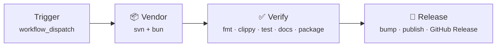

# 🚀 Release Process

This document describes the automated release pipeline for `wow-windmedia`.

Releases are driven by [cocogitto](https://docs.cocogitto.io/) — a conventional-commit–aware versioning tool integrated into GitHub Actions. Version bumps, changelog generation, crate publication, and GitHub Release creation are all handled in a single workflow run.

## ⚡ Quick Start

1. Merge your PR to `main` using conventional commit messages
2. Navigate to **Actions → Release → Run workflow**
3. Select a bump type (default: `auto`) and click **Run workflow**

That's it. The pipeline handles the rest.

## 🔄 Pipeline Overview



The pipeline runs three sequential jobs:

### 1. 📦 Vendor

Downloads third-party WoW libraries (LibSharedMedia-3.0, Serpent) via `svn export` and GitHub fetch. The resulting `vendor/` directory is shared across subsequent jobs as a workflow artifact.

### 2. ✅ Verify

Runs the full quality gate — identical to the checks in the regular CI pipeline:

- `cargo fmt --all --check`
- `stylua --check templates/*.lua`
- `cargo clippy -p wow-windmedia --all-targets -- -D warnings`
- `cargo test -p wow-windmedia`
- `cargo doc -p wow-windmedia --no-deps` (with `RUSTDOCFLAGS=-D warnings`)
- `cargo publish -p wow-windmedia --dry-run --allow-dirty`

If any step fails, the pipeline stops. Nothing is published.

### 3. 🚀 Release

Only runs if verification passes. Uses [cocogitto-action](https://github.com/cocogitto/cocogitto-action) to perform the following in sequence:

1. **Bump version** — `cog bump <type>` analyzes commits since the last tag, runs `pre_bump_hooks` (updates `Cargo.toml` via `cargo set-version`, stages the change), creates a version commit and git tag
2. **Generate changelog** — `cog changelog --at <version>` produces a Markdown changelog from conventional commits
3. **Publish** — `cargo publish` uploads the crate to [crates.io](https://crates.io/crates/wow-windmedia)
4. **Push** — `post_bump_hooks` push the version commit and tag to `main`
5. **GitHub Release** — creates a GitHub Release with the changelog body

## 📊 Bump Types

| Input       | Effect                                                                    | Example                                        |
| ----------- | ------------------------------------------------------------------------- | ---------------------------------------------- |
| `auto`      | Analyzes commit history and selects the correct semver bump automatically | `0.1.0` → `0.2.0` (if `feat:` commits present) |
| `patch`     | Increment patch version                                                   | `0.1.0` → `0.1.1`                              |
| `minor`     | Increment minor version                                                   | `0.1.0` → `0.2.0`                              |
| `major`     | Increment major version                                                   | `0.1.0` → `1.0.0`                              |
| `<version>` | Set an arbitrary version string                                           | `0.1.0-beta.1`                                 |

Use `auto` unless you need to override cocogitto's analysis.

## 🔑 Prerequisites

### Repository Configuration

| Secret                 | Purpose                                                          |
| ---------------------- | ---------------------------------------------------------------- |
| `CARGO_REGISTRY_TOKEN` | Authentication token for [crates.io](https://crates.io/) publish |

A GitHub **environment** named `release` must exist (**Settings → Environments → release**) with `CARGO_REGISTRY_TOKEN` configured as an environment secret.

`GITHUB_TOKEN` is provided automatically by GitHub Actions and used for tag pushes and Release creation — no manual configuration needed.

### 📝 Commit Messages

Cocogitto determines version bumps from conventional commit prefixes. The recognized types are configured in `cog.toml`:

| Prefix     | Changelog section |
| ---------- | ----------------- |
| `feat`     | Features          |
| `fix`      | Bug Fixes         |
| `docs`     | Documentation     |
| `refactor` | Refactoring       |
| `test`     | Tests             |
| `ci`       | CI                |
| `build`    | Build             |
| `perf`     | Performance       |
| `revert`   | Reverts           |

`chore` and `style` commits are excluded from the changelog.

## 🔧 Troubleshooting

### `cog bump auto` fails with "no conventional commits found"

Cocogitto requires at least one conventional commit since the last tag. If no qualifying commits exist, specify an explicit version:

```
Bump type: 0.1.1
```

### Publish fails with "already uploaded"

The target version already exists on crates.io. Bump to a higher version and retry.

### Verify job fails

Run the checks locally to identify the issue:

```bash
bun install && bun run update-vendor
cargo fmt --all --check
cargo clippy -p wow-windmedia --all-targets -- -D warnings
cargo test -p wow-windmedia
cargo publish -p wow-windmedia --dry-run --allow-dirty
```

## ✅ Post-Release Checklist

After a successful release, verify:

- [ ] The crate appears on [crates.io](https://crates.io/crates/wow-windmedia) with the correct version
- [ ] [docs.rs](https://docs.rs/wow-windmedia) builds successfully
- [ ] The GitHub Release renders the changelog correctly
