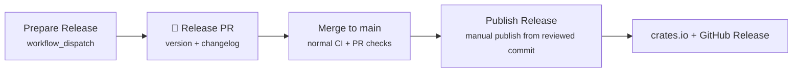

# 🚀 Release Process

This document describes the automated release pipeline for `wow-sharedmedia`.

Releases are driven by [cocogitto](https://docs.cocogitto.io/) — a conventional-commit–aware versioning tool integrated into GitHub Actions. The repository now uses a **two-phase release flow**:

1. **Prepare Release** — create a reviewed release PR that updates `Cargo.toml` and `CHANGELOG.md`
2. **Publish Release** — publish the already-reviewed `main` commit to crates.io and create the GitHub Release

This keeps `main` aligned with the exact version that gets published and avoids the old “publish first, sync PR later” failure mode.

## ⚡ Quick Start

### Beta release (`1.0.0-beta.1`)

1. Merge all feature/fix PRs for the beta into `main`
2. Navigate to **Actions → Prepare Release → Run workflow**
3. Enter an exact version such as `1.0.0-beta.1`
4. Review and merge the generated release PR
5. Navigate to **Actions → Publish Release → Run workflow**
6. Publish `ref=main`
7. Use `registry_auth=bootstrap-token` only for the first crates.io bootstrap if Trusted Publishing is not available yet; otherwise use `trusted`

### Stable release (`1.0.0`)

1. After beta validation, navigate to **Actions → Prepare Release → Run workflow**
2. Enter `1.0.0`
3. Review and merge the generated release PR
4. Run **Publish Release** with `ref=main`
5. For stable releases, the GitHub Release is created as a normal release; beta versions are created as prereleases automatically

## 🔄 Pipeline Overview



## 🧭 Prepare Release workflow

The **Prepare Release** workflow is for creating a reviewable PR before anything is published.

It performs these steps:

- creates a temporary `release/prepare-*` branch
- runs `cog bump <type-or-version>`
- updates `Cargo.toml` through `pre_bump_hooks`
- regenerates `CHANGELOG.md`
- amends the release commit so version and changelog stay together
- opens a PR back to `main`

Merge this PR only after the normal PR and CI workflows pass.

## 🚀 Publish Release workflow

The **Publish Release** workflow publishes an already-reviewed commit from `main` (or a specific commit SHA if you need to rerun a failed publish on the same reviewed commit).

It runs three sequential jobs:

### 1. 📦 Vendor

Materializes the pinned vendor snapshot declared in `vendor.lock.json`. The resulting `vendor/` directory is shared across subsequent jobs as a workflow artifact.

### 2. ✅ Verify

Runs the final release quality gate on the selected ref. It covers the core Rust and packaging checks required before publish:

- `cargo fmt --all --check`
- `stylua --check templates/*.lua`
- `cargo clippy -p wow-sharedmedia --all-targets -- -D warnings`
- `cargo test -p wow-sharedmedia`
- `cargo doc -p wow-sharedmedia --no-deps` (with `RUSTDOCFLAGS=-D warnings`)
- `cargo publish -p wow-sharedmedia --dry-run --allow-dirty`

If any step fails, the pipeline stops. Nothing is published.

### 3. 🚀 Publish

Only runs if verification passes. It performs the following in sequence:

1. **Read version** — extracts the reviewed version from `Cargo.toml`
2. **Generate release notes** — `cog changelog --at <version>` produces release notes for GitHub
3. **Publish** — `cargo publish` uploads the crate to [crates.io](https://crates.io/crates/wow-sharedmedia)
4. **GitHub Release** — creates a GitHub Release from the reviewed commit; prerelease versions are marked as prereleases automatically

## 📊 Bump Types

| Input       | Effect                                                                    | Example                                        |
| ----------- | ------------------------------------------------------------------------- | ---------------------------------------------- |
| `auto`      | Analyzes commit history and selects the correct semver bump automatically | `0.1.0` → `0.2.0` (if `feat:` commits present) |
| `patch`     | Increment patch version                                                   | `0.1.0` → `0.1.1`                              |
| `minor`     | Increment minor version                                                   | `0.1.0` → `0.2.0`                              |
| `major`     | Increment major version                                                   | `0.1.0` → `1.0.0`                              |
| `<version>` | Set an arbitrary version string                                           | `0.1.0-beta.1`                                 |

Use `auto` unless you need to override cocogitto's analysis. For the planned beta-first rollout, prefer exact versions:

- `1.0.0-beta.1`
- `1.0.0-beta.2`
- `1.0.0`

## 🔑 Prerequisites

### Repository Configuration

| Setting / secret            | Purpose                                                                 |
| --------------------------- | ----------------------------------------------------------------------- |
| `release` environment       | Protects manual publish runs and holds bootstrap-only secrets if needed |
| `CRATES_IO_BOOTSTRAP_TOKEN` | One-time fallback token for the first crates.io publish only            |

Preferred mode is **Trusted Publishing** via GitHub OIDC. The publish workflow supports:

- `registry_auth=trusted` — recommended after crates.io Trusted Publishing is configured
- `registry_auth=bootstrap-token` — temporary fallback for the very first publish if crates.io ownership must be bootstrapped first

A GitHub **environment** named `release` must exist (**Settings → Environments → release**). If you still need the bootstrap path, configure `CRATES_IO_BOOTSTRAP_TOKEN` there temporarily and delete it after Trusted Publishing is enabled.

`GITHUB_TOKEN` is provided automatically by GitHub Actions and used for release PR creation and GitHub Release creation — no manual configuration needed.

### crates.io Trusted Publishing

After the first successful publish, configure Trusted Publishing for this crate in crates.io:

1. Open the crate on crates.io
2. Go to **Settings → Trusted Publishing**
3. Add the GitHub repository `fang2hou/wow-sharedmedia`
4. Authorize the `release.yml` workflow
5. Switch future publishes to `registry_auth=trusted`
6. Delete `CRATES_IO_BOOTSTRAP_TOKEN`

### 📝 Commit Messages

Cocogitto determines version bumps from conventional commit prefixes. The recognized types are configured in `cog.toml`:

| Prefix     | Changelog section |
| ---------- | ----------------- |
| `feat`     | Features          |
| `fix`      | Bug Fixes         |
| `docs`     | Documentation     |
| `refactor` | Refactoring       |
| `test`     | Tests             |
| `ci`       | CI                |
| `build`    | Build             |
| `perf`     | Performance       |
| `revert`   | Reverts           |

`chore` and `style` commits are excluded from the changelog.

## 🔧 Troubleshooting

### `cog bump auto` fails with "no conventional commits found"

Cocogitto requires at least one conventional commit since the last tag. If no qualifying commits exist, specify an explicit version:

```
Bump type: 0.1.1
```

### Publish fails with "already uploaded"

The target version already exists on crates.io. Bump to a higher version and retry.

### Trusted Publishing is not ready yet

Use `registry_auth=bootstrap-token` for the first publish only. Once the crate exists and crates.io Trusted Publishing is configured, switch back to `trusted` and delete the bootstrap token.

### Prepare Release succeeds but no PR appears

The workflow uses `GITHUB_TOKEN` to open a PR back to `main`. Confirm that the repository allows GitHub Actions to create pull requests and that the temporary `release/prepare-*` branch was pushed successfully.

### Release notes or bump scope look wrong

The release flow relies on the latest semantic version tag. Ensure full git history is available in release workflows and keep commit / PR titles in Conventional Commit format so cocogitto can classify them correctly.

### Publish Release fails

Run the checks locally on the reviewed release commit to identify the issue:

```bash
bun install && bun run update-vendor
cargo fmt --all --check
cargo clippy -p wow-sharedmedia --all-targets -- -D warnings
cargo test -p wow-sharedmedia
cargo publish -p wow-sharedmedia --dry-run --allow-dirty
```

### Do I still need a sync PR after publishing?

No. The release version is reviewed and merged to `main` before publishing, so there is no longer a post-publish sync step.

## ✅ Post-Release Checklist

After a successful release, verify:

- [ ] The crate appears on [crates.io](https://crates.io/crates/wow-sharedmedia) with the correct version
- [ ] [docs.rs](https://docs.rs/wow-sharedmedia) builds successfully
- [ ] The GitHub Release renders the changelog correctly
- [ ] For beta releases, the GitHub Release is marked as a prerelease
- [ ] If this was the first publish, crates.io Trusted Publishing is configured before the next release
